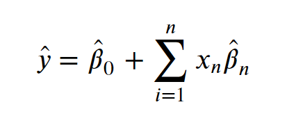
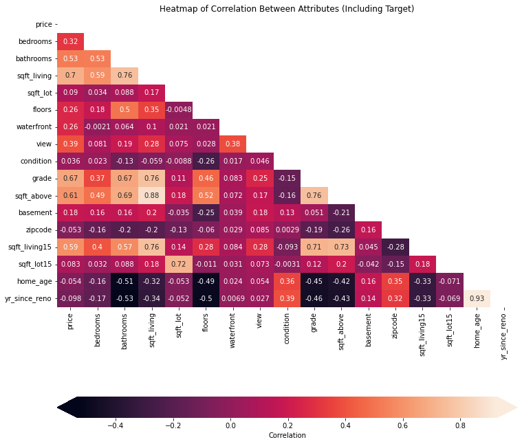
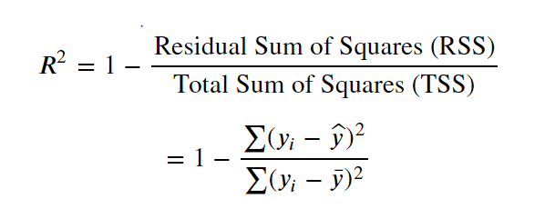
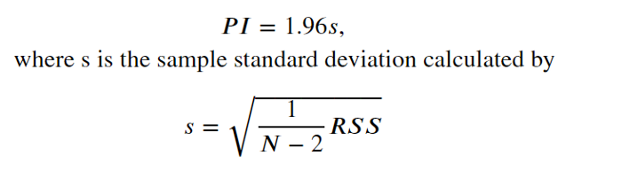
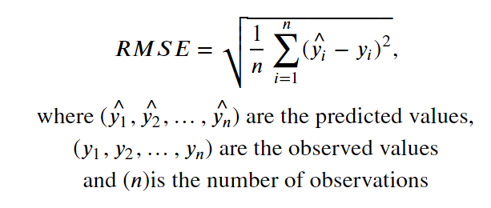
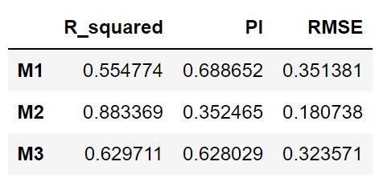
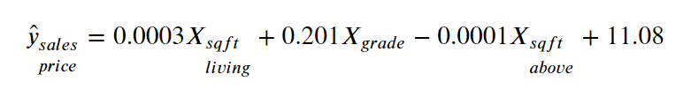

# Home Price Prediciton using Linear Regression

## Overview
The project's goal is to predict the sales price of a home in King County, WA based on the features of the home. One of the  most common methods to predict continuous values is through linear regression. Linear regression explains the relationship of independent predictor variables to a dependent predicted variable using a linear equation. The linear equation represents the best fit among the data, where given a set of predictor variables the predicted value would be found.  Ordinary least squares linear regression finds this linear equation by minimizing the sum of the squared difference between the actual observed dependent variable and the predicted value, denoted as y-hat.

This project will use a dataset of home sales and design three linear regression models. The models will be compared and the best model will be used for a backend function for a dashboard to predict the sales range for a home.

## Business Problem

Bon Jovi Real Estate Advisors is a residential real estate broker in King County, WA. Many of their clients come to them needing to sell their homes but are unsure of the price to list. The real estate broker wants us to design a model where they can take in the features of their client's home and determine which price to begin listing discussion with their client.

### Stakeholders
- President and Managing Director of Bon Jovi Real Estate Advisors
- Bon Jovi real estate agents that will use the model for price predictions

## The Data

This project uses the [King County House Sales dataset](https://www.kaggle.com/harlfoxem/housesalesprediction), which can be found as  `kc_house_data.csv` in the data folder in this repository. The description of the column names can be found in `column_names.md` in the same folder.

## Variable Names and Descriptions for King County Data Set
* `id` - Unique identifier for a house
* `date` - Date house was sold
* `price` - Sale price (prediction target)
* `bedrooms` - Number of bedrooms
* `bathrooms` - Number of bathrooms
* `sqft_living` - Square footage of living space in the home
* `sqft_lot` - Square footage of the lot
* `floors` - Number of floors (levels) in house
* `waterfront` - Whether the house is on a waterfront
  * Includes Duwamish, Elliott Bay, Puget Sound, Lake Union, Ship Canal, Lake Washington, Lake Sammamish, other lake, and river/slough waterfronts
* `view` - Quality of view from house
  * Includes views of Mt. Rainier, Olympics, Cascades, Territorial, Seattle Skyline, Puget Sound, Lake Washington, Lake Sammamish, small lake / river / creek, and other
* `condition` - How good the overall condition of the house is. Related to maintenance of house.
  * See the [King County Assessor Website](https://info.kingcounty.gov/assessor/esales/Glossary.aspx?type=r) for further explanation of each condition code
* `grade` - Overall grade of the house. Related to the construction and design of the house.
  * See the [King County Assessor Website](https://info.kingcounty.gov/assessor/esales/Glossary.aspx?type=r) for further explanation of each building grade code
* `sqft_above` - Square footage of house apart from basement
* `sqft_basement` - Square footage of the basement
* `yr_built` - Year when house was built
* `yr_renovated` - Year when house was renovated
* `zipcode` - ZIP Code used by the United States Postal Service
* `lat` - Latitude coordinate
* `long` - Longitude coordinate
* `sqft_living15` - The square footage of interior housing living space for the nearest 15 neighbors
* `sqft_lot15` - The square footage of the land lots of the nearest 15 neighbors

### Data Cleanup

The median house sold in King County, WA between 2014 to 2015 was for \$450,000. The median house sold was 1910 square feet, 3 bedroom, 2.25 bathrooms, and 47 years old. The home sale price range was $78,000 and to $7,700,000.

#### Missing Data

The data in the `waterfront`, `view`, and `yr_renovated` had `NaN` values. There are placeholder values in `yr_renovated` and `sqft_basement`. `yr_renovated` has 0 for over 95% of values which means the property was not renovated. `sqft_basement` has `?` for about 2% of its values.

#### Strategy for clean-up
- `NaN`
    - `waterfront`
        - Binary categorical variable (`YES` or `NO`)
        - replace `NaN` with mode of `NO` as most likely these properties are not waterfront
    - `view`
        - Ordinal categorical variable
        - replace `NaN` with `NONE` 
    - `yr_renovated`
        - Will be converted to a countable numerical variable
        - `0` is the most common value with over 95% of values. 
        - Replace `NaN` with 0 value
- Placeholder
    - `yr_renovated` has `0` for missing or unknown values.
    - `sqft_basement` has `?` for missing or unknown values.

### Encoding Variables
For regression analysis, catagorical data needs to be in numerical format so catagorical variables were encoded to to meet this requirement but still maintain their binary, ordinal, and count information.

- `condition`
    - Ordinal categorical variable
    - dictionary - `{'Poor': 0, 'Fair': 1, 'Average': 2, 'Good': 3, 'Very Good': 4}`
- `grade`
    - Ordinal categorical variable
    - Example: `7 Average`
    - Delete the descriptor, keep the number, and convert it to `int` datatype
- `sqft_basement`
    - Code to binary catagorical {'No': 0, 'Yes':1}
    - `?` makes up about 2% of values and the current value of `0` makes up almost 60%
    - Since 2% is a low value I will replace `?` with the mode of `0`
    - If there is a basement (sq.ft > 0) the value will be set to `1`
- `view`
    - Oridinal catagorical variable
    - dicitonary - `{'NONE': 0, 'FAIR': 1, 'AVERAGE': 2, 'GOOD': 3, 'EXCELLENT': 4}`
- `waterfront`
    - Binary catagorical variable
    - dictionary - `'NO': 0, 'YES': 1`
- `home_age`
    - Create new count variable
    - subtract current year from `yr_built`
    - Drop `yr_built`
- `yr_since_reno`
    - Make new count variable  
    - Subtract current year from `yr_renovated`
        -  `0` is the most common value with over 95% of values.
        - if never renovated then subtract from `yr_built`
    - Drop `yr_renovated`
- `zipcod`
    - Used [dummy variables](https://en.wikipedia.org/wiki/Dummy_variable_(statistics))

#### Outliers
An obvious outlier was found that I believe was a data entry error. A property is listed as having 33  bedrooms but only having 1,620 square feet in size. I edited this observation to 3 to match the median number of bedrooms in the dataset.

## Modeling

### Model 1 (M1)
M1 is the baseline model and it was chosen from the variables correlated with sales price of a house.

Independent variables correlated with `price` with Pearson's correlation (r) greater than 0.6  are `sqft_living`, `sqft_above`, `grade`. As the heatmap shows, `sqft_living` and `sqft_above` are highly correlated with each other (r = 0.88) so this will likely create multicollinearity.

### Model 2 (M2)
M2 uses an automated stepwise regression strategy.  All the variables are fed into the model fitted. The predictor variable with highest p-value is removed if the p-value is greater than 0.05. This is repeated until all the p-values of the predictor variables are less than 0.05. 

M2 has many more features than M1 and utulizes the zipcode dummy variables.

### Model 3
M3 builds on M1 by adding interaction effects to the main effects. It also removes `sqft_above` as a predictor variable. Interaction effects occur when the effect of one predictor variable depends on the value of another variable. For example, condition of a home may be dependent on the age of the home. There may be a dependency between the square feet of living space and the number of bathrooms.

## Statistics used to compare models

### Adjusted R-squared
R-squared is a statistical measurement of how close the observed data are to the regression line. It tells us if the model has can explain the variance seen in the data. Adjusted R-squared is similar to R-squared but it takes into account the number of independent variables used in the model as R-squared has a tendency to increase each time a new variable is added to the model. R-squared range from 0 to 1 with the higher the value, the more the model explains the variance.

### Prediction interval
Given specific values of independent variables, a prediction interval is a range a new single observation is likely to be. the smaller the prediction interval, the lower the range the new predicted value may fall, and thus the more confident the predicted value will be.

### Root Mean Squared Error (RMSE)
RMSE is the square-root of the  average squared difference between the estimated values and the actual value. RMSE is a measure of the mean error rate of a regression model that penalizes large errors. Larger errors between the predicted value and the actual observed value are given more weight and penalize the model. The smaller the RMSE score the better the model explains the data.

## Regression Results

### M1
The p-values indicate that each of the variables chosen has a statistical significant relationship with the dependent variable, but the r-squared value is low at 0.55. For a predictive model the R-squared needs to be higher. The function of M1 would be:

For every 1 unit increase in the log transformed living squared feet value, there is a 0.58 mean change in the predicted sale price of the home. There is a 0.22 mean change in the predicted sale price for every unit increase of the grade of a house. Interestingly, the area of the space above the home is penalized. This may be due to multicolinearity between the sqft_living and sqft_above. RMSE of M1 is 

### M2
R-squared and adjusted R-squared is 0.89 for M2. This is tremendous improvement over M1. There are many more predictor variables used in M2. M2 has 80 independent variables used to explain `price`. This R-squared score is very good for a model that will be used for prediciton.

M2 has the lowest predictive intervals. The smaller the predictive interval the more confidence the true sale price is in that region. M1 and M2 had resonably similar prediction intervals and twice the value as M2.

M2 is almost half the RMSE score of M1 and M2 indicating it produces less error between the actual and predicted values. 

### M3

R-squared and adjusted R-squared for M3 is 0.63. This is an improvement over M1 but is worse than M2. The interaction effects between some variables does seem to help increase R-squared.

RMSE is similar to M1 and less than M2.

## Conclusion and Recommendations
M2 is the best model as compared to M1 and M3 because it has a higher adjusted R-squared, smaller RMSE, and smaller prediciton intervals.

This model could be improved upon by adding more data additional features, such as crime rate in the geographic location, the zoned school ranking, and time on the market. The GPS coordinates of the sold house could be used to collect the first two of these variables. The Multiple Listing Service may be a source for more recent data and on how long a house was on the market from day of listing to closing date. 

Anther source of data could be in the internal data of our brokerage client. They possibly have data of properties they were involved with such as the data of the asking and bidding price of the property. We could use this data to identify homes that were under listed by identifying properties that had offers substantially more than the asking price. Conversly, properties that were over-listed by setting an asking price that was higher than the final accepted bid offer.

## Summary
- Model 2 is the best model to continue with as it has the best predictive capabilities.
- Model 2 could be used as a prototype for a dashboard the client can use to a range for a asking price.
- Gather more data and variables to improve the model's predictive power
- Communicate with client about internal data that can be used to train the model